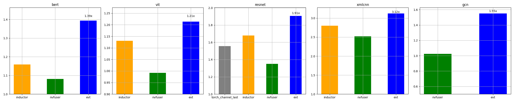
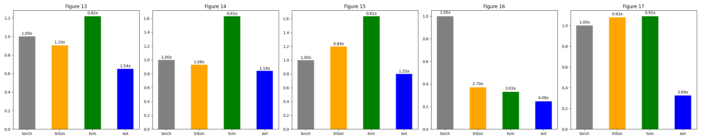

# Artifact Evaluation of EVT ASPLOS'24

This repo is the EVT compiler 
targeting single-GPU & distributed training & inference of Deep Learning Models.

## Compatibility

The following environment have been tested
| Hardware| PyTorch Version | CUDA version |
| --      | --              | --           |
| NVIDIA A100 Tensor Core GPU 40 GB | 2.1.0a0+1767026 | CUDA v12.1.66

## Getting Started

We recommend using the docker image:
```bash
git clone https://github.com/apuaaChen/EVT_AE.git
cd EVT_AE
git submodule update --init --recursive
export MLCOMPILER_DIR=</path/to/your/clone>
bash build.sh evt_ae
docker run --gpus all --name evt_ae_test -v ${MLCOMPILER_DIR}:/workspace/EVT_AE -it evt_ae
```

Inside the docker container, to install gtl library:
```
cd /workspace/EVT_AE/python && bash install.sh
```


## Reproduce the experimental results
To reproduce Figure 12, 13-17, run:
```
cd /workspace/EVT_AE
bash figure12.sh
bash figure13_17.sh
```
The reference results of the two figures are listed below:


